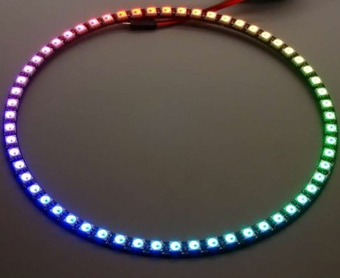
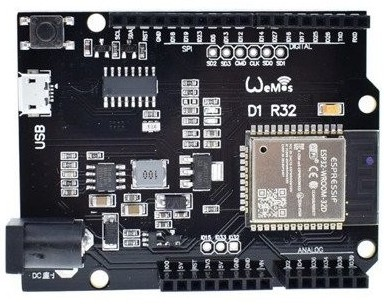
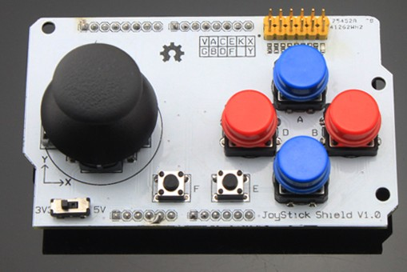

# RGBLedRing

## Hardware

* Anillo led con  60 Leds RGBs

* Controlado por un ESP32 en una placa Wemos D1 R32 

* Joystick Shield de elecfreaks ([Documentación](https://www.elecfreaks.com/blog/post/joystick-shield-quickstart-guide.html) [Ejemplos de elecfreaks](./code/) ) 

## Software

* Programado en micropython
* v0.1 Encendido de leds
* v1.0 Control de color por zonas

* 

